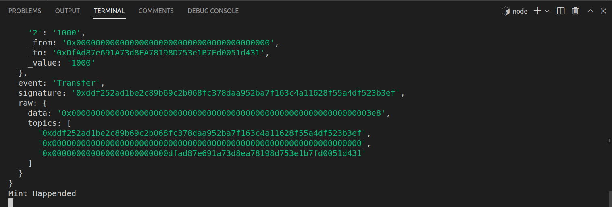

# ERC20 🔛 Transfer Transaction Indexer📝

- This is a Simple Project to Store the Transfer Events of ERC20 Smart contract using Web3.

## Getting started 📖

📁 Create a new folder in VScode 
Open Your termial in Vscode. or press  `Ctrl+Shift+` `

🏃 Run: -- Initalize Node  
```
npm init 
```
or use ( Here `-y` means we are saying `yes` to all steps in node creation )

```
npm init -y
```

## Node Dependencies 🎒

``` 
npm install express
```

``` 
npm install mongoose
```

``` 
npm install human-standard-token-abi
```

``` 
npm install web3
```

``` 
npm install dotenv
```
## MVC Architecture 🛡
- Folder Structure


## Steps to do 🛠️

- Deploy a ERC20 Smart Contract in Remix.

- Copy your Smart Contract and paste it in your `.env` file.

- Copy your websocket address from `Infura` and paste it in your `.env` file.

```
WEB_SOCKET = "wss://goerli.infura.io/ws/v3/<infura id>"
CONTRACT_ADDRESS = "paste your contrtact address"
```

- In `MongoDB`🛢 create a collection called Blockchain to store Transfer Transaction Data.

- In Postman call the API URL to see the transfer transactions of specific account

- If you call non transfer transaction address it will show 

### Example :


## To Run 🏃

```
 node app.js
```


## API call 📡
- URL: Syntax
```
 localhost:3000/getTrasferTx/<paste your address>
```
- URL: Example
```
 localhost:3000/getTrasferTx/0xDfAd87e691A73d8EA78198D753e1B7Fd0051d434
```


- If you are query non transaction address then result will be returned as 


## Result 💯
- After you deoplyed `ERC20 Smart Contract in Remix` and configured your `.env` in node application then start your node app.

- Do `Mint` Some tokens in your account by calling `mint function` in remix.


- After token is minted then do `transfer` your token with the help of by calling `transfer function` in remix, then your transaction will stored in DB


- Then call your API on postman to see the trasnferEvent transaction result.


## Transaction URL:
https://goerli.etherscan.io/token/0x68e964df8f89f1d99f74c93f4b579fce041f5a41
